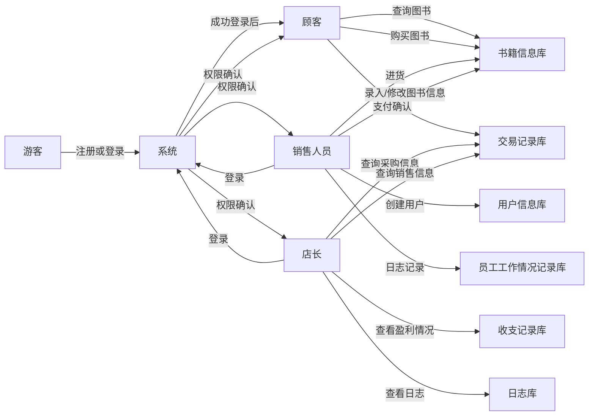
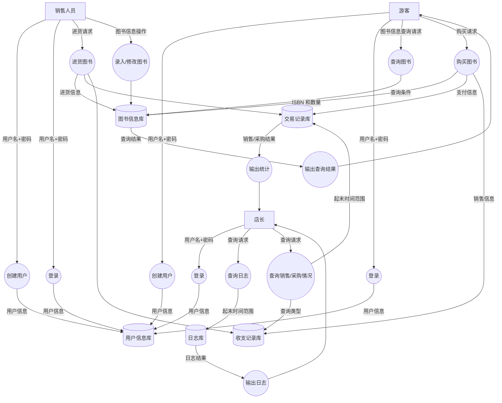

# 需求分析

## 一、业务流图




## 二、数据流图




## 三、数据词典

请描述书店系统涉及的数据项及其含义。

### 1.用户数据

（1） UserID: 用户的标识符，由系统生成，用于登录和存储对应的购买信息

（2）Username: 用户的用户名，需要创建时自己设定

（3）Password: 用户的密码，创建时设置，用于登录

（4）Role: 存储enum类型数据表示是顾客还是员工还是店长

### 2.图书数据

（1）ISBN: 20个字符，唯一标识符

（2）BookName: 60个字符，图书的书名

（3）BookAuthor:  60个字符，图书的作者

（4）Keyword： 总共不超过60个字符，图书的关键字

（5）Stock: 整型，库存量

（6）Price: 销售的单价，非负实型

（7）PurchasePrice: 进货价格，用于财务信息记录和销售人员输入

### 3.交易数据

（1）UserID: 交易涉及的用户

（2）ISBN: 购买的书对应的标识符

（3）Number: 购买的数量

（4）UnitPrice: 图书的单价

（5）TotalPrice: 图书的总价

（6）type: 交易类型，分为采购和销售

（7）time: 记录交易的时间

### 4.财务数据

（1）Income: 总收入，销售交易金额总和

（2）Expenditure: 总支出，采购交易金额总和

（3）Profit: 净利润，总收入-总支出

（4）StartTime: 统计的开始时间，用于查询

（5）EndTime: 统计结束的时间，用于查询

### 5.日志信息

（1）Date: 操作的时间

（2）UserID: 执行操作用户的标识符

（3）ActionType: 操作类型（包括查询/更改/注册/登录/采购/销售等等）

（4）Object: 操作的对象（书或者用户）

（5）Role: 用户的类型（顾客/员工/店长）

（6）LogID: 日志的标识符

## 四、功能说明

请描述书店系统各个模块的功能，包括模块名称、功能描述、输入输出参。例如：功能1：名字、输入、输出、所做的处理.

### 功能1：用户创建

输入：用户的用户名，密码，以及用户类型（顾客、销售人员或者店长）

输出：是否成功创建

处理：将用户名、密码以及自动生成的用户ID存储到用户信息库里

### 功能2：登录

输入：用户的用户名，密码

输出：是否成功登录

处理：先判断用户名是否存在，再判断密码是否正确

### 功能3：录入/修改图书信息

输入：操作的时间和类型（录入或修改），录入的图书信息或者要修改的数据项的信息

输出：是否成功录入或修改

处理：录入时判断是否存在完全相同的图书信息，若无则在图书信息库加入录入信息；修改时判断目标图书是否存在，再修改对应数据项。把操作加入日志库

### 功能4：进货

输入：购入的时间、图书的ISBN和购入数量以及单价

输出：无

处理：分配ID之后把进货数据录入交易记录库，然后更改图书信息库的信息，最后把进货操作加入日志库

### 功能5：查询

输入：要查询的类型（书名、关键字等等）

输出：符合类型的图书

处理：在图书信息库中查找符合条件的图书，然后输出

### 功能6：顾客购买图书

输入：购买的书名和数量

输出：是否成功购买， 需要的总价格

处理：分配ID之后在交易记录库中输入购买的信息，然后更改图书信息库的数据，最后把购买的记录加入日志库

### 功能7：店长查询日志

输入：要查询的类型（全部还是销售人员的日志）以及起始时间、结束时间

输出：工作情况报告或者工作日志

处理：在日志库中查找对应时间段的满足条件的日志信息后输出

### 功能8：查询销售/采购情况

输入：查询对象（销售/采购）以及起始时间、结束时间

输出：采购信息（即按照采购顺序输出采购图书的 ISBN 号、数量、单价等）、销售情况（即按照销售顺序输出售出图书的 ISBN 号、数量、单价等）

处理：在交易记录库里查找满足条件的交易

### 功能9：查询盈利情况

输入：查询的起始时间和结束时间

输出：该段时间内的收入、支出和总利润

处理：在收支信息库里查找对应时间段的收入和支出，并计算总利润


## 五、用户交互设计

### 1.游客：

**（1）注册**

输入：

```bash
register <username> <password>
```

输出：

成功：

```bash
[SUCCESS] User "<username>" registered successfully.
```

失败：

```bash
[ERROR] Username "<username>" already exists.
```

### 2.顾客

**（1）登录**

输入：

```bash
login <username> <password>
```

输出：

成功：

```bash
[SUCCESS] User "<username>" logged in as customer.
```

失败：

```bash
[ERROR] Incorrect username or password.
```

**（2）查询**

输入：

```bash
query <field>=<value> [<field2>=<value2> ...]
```

输出：

成功（返回结果列表）：

```yaml
[SUCCESS]
[RESULT]
item1: <ISBN> | <Bookname> | <BookAuthor> | <Keyword> | <Stock> | <Price>
item2: ...
...
```

失败：

```yaml
[INFO] No books found matching the query.
```

**（3）购买**

输入：

```bash
buy <ISBN>: <quantity>
```

输出：

成功：

```bash
[SUCCESS] Purchased <quantity> copies of "<Bookname>". Total cost: $ <total>.
```

失败：

库存不足：

```bash
[ERROR] Insufficient stock for ISBN "<ISBN>". Available: <stock>.
```

目标图书不存在：

```bash
[ERROR] No books found.
```

### 3.销售人员

**（1）登录**

输入：

```bash
login <username> <password>
```

输出：

成功：

```bash
[SUCCESS] User "<username>" logged in as salesman.
```

失败：

```bash
[ERROR] Incorrect username or password.
```

**（2）录入图书**

输入：

```bash
add <ISBN> <title> <author> <keywords> <quantity> <price>
```

成功：

```bash
[SUCCESS] Book "<title>" added successfully with ISBN "<ISBN>".
```

失败：

```bash
[ERROR] ISBN "<ISBN>" already exists. Use 'modify' to update the book details.
```

**（3）修改图书信息**

输入：

```bash
modify <ISBN> [field]=[new_value] ...
```

输出：

成功：

```bash
[SUCCESS] Updated book with ISBN "<ISBN>". Modified fields: price, stock.
```

失败：

```bash
[ERROR] Book with ISBN "<ISBN>" not found.
```

**（4）进货**

输入：

```bash
supply <ISBN> <quantity> <price>
```

输出：

成功：

```bash
[SUCCESS] Supplied <quantity> copies of "<title>" at $ <price> each.
```

失败：

```bash
[ERROR] ISBN "<ISBN>" not found. Use 'add' to register the book.
```

### 4.店长

**（1）登录**
输入：

```bash
login <username> <password>
```

输出：

成功：

```bash
[SUCCESS] User "<username>" logged in as boss.
```

失败：

```bash
[ERROR] Incorrect username or password.
```

**（2）查询销售/采购记录**

输入：

```bash
query_records <type> <start_date> <end_date>
```

输出：

成功：

```yaml
[RESULTS]
Transaction1: <TransactionID> | <ISBN> | <Quantity> | <Price> | <Time>
...
```

失败：

```bash
[INFO] No <type> records found between <start_date> and <end_date>.
```

**（3） 查看财务统计**

输入：

```bash
query_finance <start_date> <end_date>
```

输出：

成功：

```yaml
[FINANCE REPORT]
<Start Date> | <End Date>
<Income> | <Expenditure> | <Profit>
```

失败：

```bash
[ERROR] Invalid date.
```

**（4）查看工作日志**

输入：

```bash
query_logs <type> <start_date> <end_date>
```

成功：

```yaml
[WORK LOGS]
<time> | <user> | <role> | <action> | <info> | <result>
e.g 2024-12-01 15:00:00 | Dick | Salesman | Add Book | ISBN=9781234567890 | Success
```

失败：

```bash
[INFO] No logs found between <start_date> and <end_date>.
```

